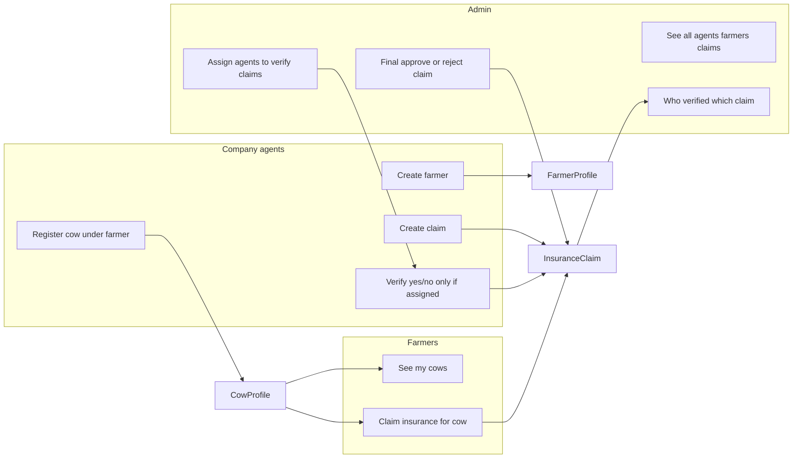

# Company Agents, Farmers, Admin and Insurance Claims

## Current implementation (summary)

- **Auth**: Django `User` only; no roles. Session auth; most endpoints use `AllowAny`. Plan: switch to **JWT** for API authentication.
- **Data**: [CowProfile](cow_detection_backend/api/models.py) has `ForeignKey(User)`; registration can create a new user (by username) or use existing; no concept of "owner" vs "agent".
- **Endpoints**: `POST /api/register/`, `GET /api/profiles/` (all profiles), `POST /api/classify/`, `GET /api/user/`, `GET /api/training-status/<id>/`. No claim or verification flows.

---

## Target behavior

**Naming:** **company agents**, **farmers**, and **admin** (three roles).

| Actor             | Capabilities                                                                                                                                                                    |
| ----------------- | ------------------------------------------------------------------------------------------------------------------------------------------------------------------------------- |
| **Company agent** | Create farmer profile; register cow under a farmer; create claim for a cow; **verify** cow (yes/no) **only when assigned** by admin. Agent **cannot** approve claims.           |
| **Farmer**        | See list of cows under their profile; claim insurance for a cow.                                                                                                                |
| **Admin**         | Assign agents to verify claims; **final approval** of claims (approve/reject). See all information: agents, farmers, pending claims, registered cows, who verified which claim. |

---

## 1. Data model changes

**1.1 User type (role) — first proposal: add UserProfile**

- Add a **UserProfile** model with:
  - `OneToOneField(User, on_delete=CASCADE, related_name='profile')`
  - `user_type`: CharField with choices `company_agent`, `farmer`, `admin`
- One migration; backfill existing users (e.g. default to `farmer` if they have cow_profiles).

**1.2 Insurance claim**

- New model **InsuranceClaim** in [api/models.py](cow_detection_backend/api/models.py):
  - `cow_profile` → `ForeignKey(CowProfile, on_delete=...)`
  - `status`: e.g. `pending`, `approved`, `rejected` (final status set by **admin** only)
  - `reason`: e.g. `dead`, `sick` (CharField with choices or free text)
  - `created_by` → `ForeignKey(User)` (who submitted: company agent or farmer)
  - `submitted_at` (auto)
  - **Assignment (admin assigns agent to verify):** `assigned_to` → `ForeignKey(User)`, nullable (company agent); `assigned_at`, `assigned_by` → `ForeignKey(User)` (admin), nullable
  - **Verification (agent says yes/no, only if assigned):** `verification_result` (boolean or yes/no), `verified_at`, `verified_by` → `ForeignKey(User)` (agent), nullable
  - **Final approval (admin only):** `approved_at`, `approved_by` → `ForeignKey(User)` (admin), nullable
  - Optional: `notes` for verification/approval comments.
- Add migration for **InsuranceClaim**.

---

## 2. Permissions and auth

**2.1 JWT authentication**

- Use **JWT (JSON Web Token)** for API authentication (replace or supplement Session auth for the API).
- **Token flow**: Client sends credentials (e.g. username/password) to a login endpoint; server returns an **access token** (JWT). Client sends `Authorization: Bearer <access_token>` on subsequent requests.
- **Implementation**: Use **djangorestframework-simplejwt** (or similar): add to `REST_FRAMEWORK['DEFAULT_AUTHENTICATION_CLASSES']` (e.g. `JWTAuthentication`). Optional: refresh token endpoint for long-lived sessions.
- **Endpoints**: **POST** `/api/token/` — request body `username`, `password`; response `{ "access": "<jwt>", "refresh": "<jwt>" }` (if using refresh). **POST** `/api/token/refresh/` (optional) for refresh token.
- All role-sensitive endpoints require a valid JWT; return 401 if missing or invalid.

**2.2 Role checks and scoping**

- **Enforce authentication** on all role-sensitive endpoints (create farmer, register cow under someone, create/assign/verify/approve claim, list "my cows").
- **Permission helpers**: e.g. `user_is_company_agent(user)`, `user_is_farmer(user)`, `user_is_admin(user)` (from UserProfile). Return 403 when the wrong role calls an endpoint.
- **Scoping**:
  - **Farmer**: list only cows where `cow_profile.user == request.user`.
  - **Company agent**: list cows they're allowed to manage (e.g. all farmers' cows); create claims; verify (yes/no) only claims assigned to them.
  - **Admin**: assign agents to verify; final approve/reject claims; read-only access to everything (all agents, all farmers, all claims, all cows); no scope limits.

---

## 3. API changes and new endpoints

**3.1 Farmer profile creation (company agent only)**

- **POST** `/api/farmers/`: body `username`, `email`, `password`, `first_name`, `last_name`. Create Django `User` + set `UserProfile.user_type = farmer`. Return user id and minimal profile. Require authenticated company agent.

**3.2 Register cow under a farmer (company agent only)**

- **Change** [views.register](cow_detection_backend/api/views.py) and [CowRegistrationSerializer](cow_detection_backend/api/serializers.py):
  - **Only company agents** can call **POST** `/api/register/`. Farmer **cannot** register a cow. Return 403 for farmers or unauthenticated.
  - Require body field `owner_id` (User id of the farmer). Attach the new cow to that farmer. `owner_id` must be a valid farmer (UserProfile.user_type = farmer).
- Keep same multipart/form-data contract (cow_name, muzzle_photos, etc.); `owner_id` (integer) is **required**.

**3.3 List cows under "my" profile (farmer)**

- **GET** `/api/my-cows/` (or restrict existing `GET /api/profiles/` by role): return `CowProfile.objects.filter(user=request.user)`. Require authenticated farmer (and optionally allow company agent to see all or filter by owner). If you keep `GET /api/profiles/` as "all profiles", add a separate `GET /api/my-cows/` for farmer so they only see their own.

**3.4 Create claim (farmer and company agent)**

- **POST** `/api/claims/`: body `cow_profile_id` (or `cow_id`), `reason` (e.g. `dead`/`sick`).  
  - **farmer**: only allow if `cow_profile.user == request.user`. Create **InsuranceClaim** with `created_by=request.user`, `status=pending`.  
  - **company agent**: allow for any cow (or any cow under a farmer they manage). Same creation.
- Return created claim (id, status, cow, reason, submitted_at).

**3.5 Verify cow and approve claim (company agent only)**

- **POST** `/api/claims/<id>/verify/` (or `/api/claims/<id>/approve/`): body e.g. `action: "approve" | "reject"`, optional `notes` or verification comment. Optionally attach a "verification" (e.g. result of classify) in the body or in notes.  
- View: ensure `request.user` is company agent; set `claim.status`, `verified_at`, `verified_by`; save.  
- **Verify cow** can mean: (a) company agent calls existing `POST /api/classify/` with an image, then approves the claim with that outcome in notes; or (b) a dedicated "verify" step that stores verification result on the claim. Simplest: approve/reject endpoint plus optional `verification_notes` or `classification_result` text field.

**3.6 List claims (farmer / company agent)**

- **GET** `/api/claims/`:  
  - **Farmer**: filter by `cow_profile__user=request.user` (or `created_by=request.user`).  
  - **Company agent**: all claims or filter by status.
- Query params: `?status=pending`, `?cow_profile_id=...`. Response includes `verified_by` (agent user id/username) when present.

**3.7 Admin: see all information (admin only)**

- **GET** `/api/admin/dashboard/` (or `/api/admin/stats/`): aggregate counts — total registered cows, pending claims count, approved/rejected counts. Require admin.
- **GET** `/api/admin/company-agents/`: list all company agent profiles (user id, username, email, etc.). Require admin.
- **GET** `/api/admin/farmers/`: list all farmer profiles (user id, username, email, cow count per farmer, etc.). Require admin.
- **GET** `/api/admin/claims/`: list all claims with full detail: `assigned_to`, `assigned_by`, `verification_result`, `verified_by`, `verified_at`, `approved_by`, `approved_at`, `cow_profile`, farmer, `status`, `reason`. Optional query params: `?verified_by=<user_id>`, `?assigned_to=<user_id>`, `?status=pending`.
- Restrict **GET** `/api/profiles/` (all cow profiles) to admin (and optionally company agent) so farmers cannot see everyone's cows.

---

## 4. Implementation order (suggested)

1. **JWT authentication**: Install `djangorestframework-simplejwt`; configure `JWTAuthentication` in DRF settings; add **POST** `/api/token/` (and optionally `/api/token/refresh/`). Require JWT on protected endpoints.
2. Add **UserProfile** (user_type) and **InsuranceClaim** models; migrations.
3. Add permission helpers and protect role-based endpoints (auth + user_type checks).
4. Implement **POST** `/api/farmers/` (create farmer).
5. Update **POST** `/api/register/` to accept `owner_id` for company agent and scope cow ownership.
6. Add **GET** `/api/my-cows/` for farmer (and optionally restrict `GET /api/profiles/` or leave as-is for admin).
7. Implement **POST** `/api/claims/` (create claim) and **GET** `/api/claims/` (list).
8. Implement **POST** `/api/claims/<id>/assign/` (admin assign agent to claim), **POST** `/api/claims/<id>/verify/` (agent verify yes/no, only when assigned), **POST** `/api/claims/<id>/approve/` (admin final approve/reject).
9. Implement admin read endpoints: **GET** `/api/admin/dashboard/`, **GET** `/api/admin/company-agents/`, **GET** `/api/admin/farmers/`, **GET** `/api/admin/claims/`; restrict **GET** `/api/profiles/` to admin (and optionally company agent).
10. Update [API_DOCUMENTATION.md](cow_detection_backend/API_DOCUMENTATION.md) with new endpoints, request/response samples, and which role can call each.

---

## 5. Clarifications (resolved)

- **Backward compatibility**: Not needed. **POST** `/api/register/` will require authentication: only company agent can call it; agent must pass `owner_id` (farmer). Farmer cannot register a cow. No unauthenticated registration.
- **Claim creation**: Farmer can create a claim **only for their own cows**. Company agent can create a claim **for any cow**.
- **Verification vs approval**: Company agent **cannot** approve a claim. Agent can only **verify (yes/no)**. Agent can verify **only if admin has assigned that agent** to the claim. **Admin** assigns agents to verify claims and does **final approval** (approve/reject).

---

## 6. Diagram (high-level)

This plan gives you a clear path from your current single-user, no-claims implementation to company agents, farmers, admin, and the insurance claim workflow, with minimal breaking changes if you keep unauthenticated register as an option.
